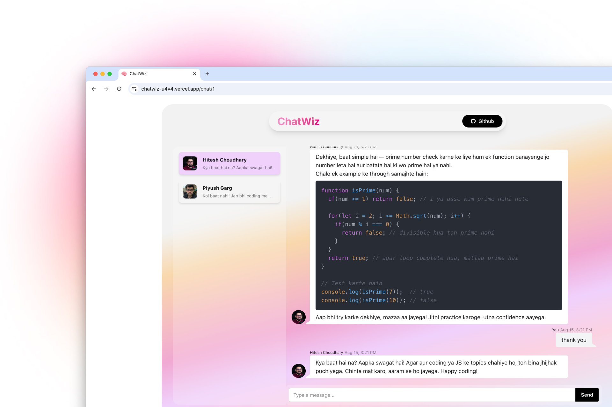

# ChatWiz 🤖💬

An interactive multi-persona AI chat app where you can talk to different personas, each with unique system prompts, and get beautifully formatted responses (including syntax-highlighted code). Built with **Next.js**, **TypeScript**, **Zustand**, **Tailwind CSS**, and **DaisyUI**.


## Features

- **Multiple Personas:** Switch between different AI personalities with their own system prompts.
- **Markdown Support:** AI responses are rendered with full Markdown (headings, lists, tables, etc.).
- **Syntax Highlighting:** Beautiful, theme-based code blocks via `react-syntax-highlighter`.
- **Loading States:** Dots animation while the assistant is typing.
- **Persistent Chat History (per room):** Optionally store chats in `localStorage` keyed by chatroom ID.
- **Rate Limiting:** Limit API calls per IP (e.g., 10 requests per session).
- **Responsive UI:** Styled with Tailwind CSS + DaisyUI for clean, mobile-friendly layouts.

## Tech Stack

- **Framework:** Next.js 15 (App Router)
- **Language:** TypeScript
- **Styling:** Tailwind CSS + DaisyUI
- **Markdown Rendering:** `react-markdown` with `remark-gfm`
- **Code Highlighting:** `react-syntax-highlighter` with Prism theme
- **State Management:** Zustand for state management
- **API Layer:** Next.js Route Handlers to handle API requests

## Getting Started

**Prerequisites:** Node.js 18+ and npm/yarn/pnpm

```bash
git clone https://github.com/n4ryn/chatwiz.git
cd chatwiz
npm install
npm run dev
```

To build and run:

```bash
npm run build
npm run start
```

---

## Usage

1. Select a persona from the persona list.
2. Type your message and press **Send**.
3. Watch AI respond in Markdown format with code syntax highlighting if applicable.
4. Switch between chatrooms — each room’s history is maintained separately.

## Demo



## [Video Demo on https://cap.so/s/tatf805e41dg4pf](https://cap.so/s/tatf805e41dg4pf) (Click on the link to watch the video)

## Contributing & Support

- Open an issue or feature request on [GitHub Issues](https://github.com/n4ryn/chatwiz/issues).
- Reach out on [Twitter](https://x.com/n4ryn_) or [LinkedIn](https://www.linkedin.com/in/n4ryn/).

## Badges

[](https://github.com/n4ryn/chatwiz/stargazers)
[](https://github.com/n4ryn/chatwiz/network)
