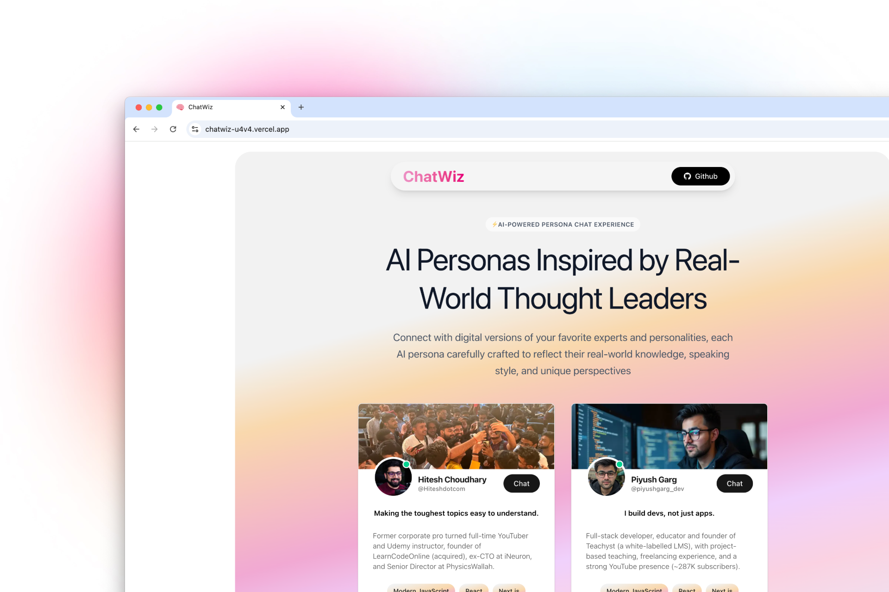

<!-- # ChatWiz 🧠

An interactive tokenizer playground to explore how text breaks into tokens, how unique token IDs are assigned, and how decoding works - all powered by a custom tokenizer with a clean UI built on DaisyUI and Tailwind CSS.



### Demo

[Video Demo on https://cap.so/s/tatf805e41dg4pf](https://cap.so/s/tatf805e41dg4pf)

## Features

- **Corpus Learning:** Type or paste large paragraphs to _learn_ vocabulary explicitly.
- **Dynamic Vocabulary Growth:** Vocabulary updates both when learning corpus and dynamically as you type in the Encoding input.
- **Persistent Vocabulary:** Vocabulary is stored centrally in React Context and persisted to a Github Gist for accessibility of vocabulary across devices.
- **Encoding:** Instantly see tokens and their assigned IDs for any text input.
- **Decoding:** Decode by entering comma-separated token IDs, showing the original text.
- **Token Visualization:** View tokens with color-coded types (words, punctuation, whitespace, etc.).
- **Custom Tokenizer Logic:** Pure JavaScript tokenizer with no external dependencies, designed for transparency and customization.

## Tech Stack

- React + TypeScript + Vite.
- Tailwind CSS + DaisyUI for responsive, accessible styling.
- React Context + Hooks for centralized vocabulary state management.
- Github Gist API to persistent storage of vocabulary.

## Getting Started

Prerequisites: Node.js 18+ and npm.

```bash
git clone https://github.com/n4ryn/genai-tokenizer.git
cd genai-tokenizer
npm install
npm run dev
```

To build and preview:

```bash
npm run build
npm run preview
```

## Usage Tips

- **Corpus:** Use the default corpus or type your own text — click "Learn Vocabulary" to update the vocabulary from the corpus explicitly.
- **Encoding:** Enter any text prompt to see tokenization live; vocabulary updates dynamically as you type here as well.
- **Decoding:** Input comma-separated token IDs to see the corresponding decoded text.
- **Clear & Reset:** Clear inputs as needed; vocabulary is managed centrally and reflects updates across all components.

## Tokenizer Details

- **Token Types Recognized:** words, numbers, punctuation, whitespace, special tokens.
- **Vocabulary Management:** Centralized via React Context, updated from corpus or encoding inputs, and persisted to `vocab.json` on Github Gist.
- **Encoding:** Assigns incremental numeric IDs per unique token, merging new tokens into existing vocabulary.
- **Decoding:** Maps numeric IDs back to tokens; unknown IDs render as `[UNK]`.
- **Performance:** Vocabulary updates are batched and memoized to prevent unnecessary recomputations and UI re-renders.

## Contributing & Support

- Open an issue or feature request on [GitHub Issues](https://github.com/n4ryn/genai-tokenizer/issues).
- Reach out on [Twitter](https://x.com/n4ryn_) or [LinkedIn](https://www.linkedin.com/in/n4ryn/).

## Badges

[](https://github.com/n4ryn/genai-tokenizer/stargazers)
[](https://github.com/n4ryn/genai-tokenizer/network) -->

# ChatWiz 🤖💬

An interactive multi-persona AI chat app where you can talk to different personas, each with unique system prompts, and get beautifully formatted responses (including syntax-highlighted code). Built with **Next.js**, **TypeScript**, **Zustand**, **Tailwind CSS**, and **DaisyUI**.


## Features

- **Multiple Personas:** Switch between different AI personalities with their own system prompts.
- **Markdown Support:** AI responses are rendered with full Markdown (headings, lists, tables, etc.).
- **Syntax Highlighting:** Beautiful, theme-based code blocks via `react-syntax-highlighter`.
- **Loading States:** Dots animation while the assistant is typing.
- **Persistent Chat History (per room):** Optionally store chats in `localStorage` keyed by chatroom ID.
- **Rate Limiting:** Limit API calls per IP (e.g., 10 requests per session).
- **Responsive UI:** Styled with Tailwind CSS + DaisyUI for clean, mobile-friendly layouts.

## Tech Stack

- **Framework:** Next.js 15 (App Router)
- **Language:** TypeScript
- **Styling:** Tailwind CSS + DaisyUI
- **Markdown Rendering:** `react-markdown` with `remark-gfm`
- **Code Highlighting:** `react-syntax-highlighter` with Prism theme
- **State Management:** Zustand for state management
- **API Layer:** Next.js Route Handlers to handle API requests

## Getting Started

**Prerequisites:** Node.js 18+ and npm/yarn/pnpm

```bash
git clone https://github.com/n4ryn/chatwiz.git
cd chatwiz
npm install
npm run dev
```

To build and run:

```bash
npm run build
npm run start
```

---

## Usage

1. Select a persona from the persona list.
2. Type your message and press **Send**.
3. Watch AI respond in Markdown format with code syntax highlighting if applicable.
4. Switch between chatrooms — each room’s history is maintained separately.

## Demo


## [Video Demo on https://cap.so/s/tatf805e41dg4pf](https://cap.so/s/tatf805e41dg4pf) (Click on the link to watch the video)

## Contributing & Support

- Open an issue or feature request on [GitHub Issues](https://github.com/n4ryn/chatwiz/issues). - Reach out on [Twitter](https://x.com/n4ryn_) or [LinkedIn](https://www.linkedin.com/in/n4ryn/).

## Badges

[](https://github.com/n4ryn/chatwiz/stargazers)
[](https://github.com/n4ryn/chatwiz/network)
